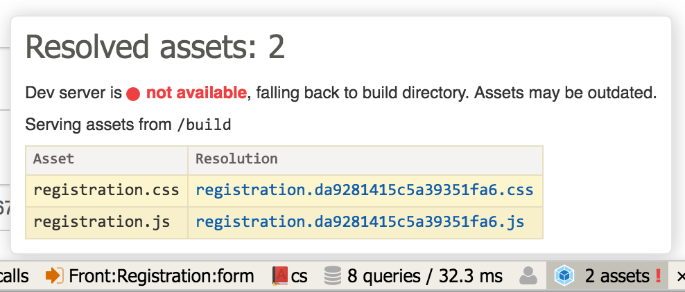

# Webpack

## Contents

- [Setup](#setup)
- [Usage](#usage)

## Setup

```bash
composer require contributte/webpack
```

## Usage

Register the extension in your config file, and configure it. The two `build` options are mandatory:

```neon
extensions:
	webpack: Contributte\Webpack\DI\WebpackExtension(%debugMode%, %consoleMode%)

webpack:
	build:
		directory: %wwwDir%/dist
		publicPath: dist/
```


Now you can use the `{webpack}` macro in your templates. It automatically expands the provided asset name to the full path as configured:

```latte
<script src="{webpack app.js}"></script>
```


### webpack-dev-server integration

You might want to use the Webpack's [dev server](https://www.npmjs.com/package/webpack-dev-server) to facilitate the development of client-side assets. But maybe once you're done with the client-side, you would like to build the back-end without having to start up the dev server.

This package effectively solves this problem: it automatically serves assets from the dev server if available (i.e. it responds within a specified timeout), and falls back to the build directory otherwise. All you have to do is configure the dev server URL. The dev server is enabled automatically in debug mode; you can override this setting via `enabled` option:

```neon
webpack:
	devServer:
		enabled: %debugMode% # default
		url: http://localhost:3000
		timeout: 0.1 # (seconds) default
```

#### Ignored assets

You can also configure a set of asset names that should be ignored (i.e. resolved to an empty data URI) if the dev-server is available. This can be helpful e.g. if you use [`style-loader`](https://www.npmjs.com/package/style-loader) in development which does not emit any CSS files.

```neon
webpack:
	devServer:
		ignoredAssets:
			- main.css
```

#### Public URL (e.g. Docker usage)

Dev-server might have different URLs for different access points. For example, when running in Docker Compose setup, the Nette application accesses it via the internal Docker network, while you access it in the browser via the exposed port. For this, you can set up a different `publicUrl`.   

```neon
webpack:
	devServer:
		url: http://webpack-dev-server:3000 # URL over internal Docker network
		publicUrl: http://localhost:3030 # exposed port from the dev-server container
```


### Asset resolvers and manifest file

You might want to include the Webpack's asset hash in its file name for assets caching (and automatic cache busting in new releases) in the user agent. But how do you reference the asset files in your code if their names are dynamic?

This package comes to the rescue. You can employ the [`webpack-manifest-plugin`](https://www.npmjs.com/package/webpack-manifest-plugin) or some similar plugin (see below) to produce a manifest file, and then configure the adapter to use it:

```neon
webpack:
	manifest:
		name: manifest.json
```

This way, you can keep using the original asset names, and they get expanded automatically following the resolutions from the manifest file.

This package automatically optimizes this in production environment by loading the manifest file in compile time.


#### Manifest mappers

By default, the manifest loader supports the aforementioned `webpack-manifest-plugin`. If you use a different plugin that produces the manifest in a different format, you can implement and configure a mapper for it. This package comes bundled with a mapper for the [`assets-webpack-plugin`](https://www.npmjs.com/package/assets-webpack-plugin):

```neon
webpack:
	manifest:
		name: manifest.json
		mapper: Contributte\Webpack\Manifest\Mapper\AssetsWebpackPluginMapper
```

You can also implement your own mapper, simply extend `Contributte\Webpack\Manifest\ManifestMapper` and implement its `map()` method. It takes the parsed JSON content of the manifest file and is expected to return a flat array mapping asset names to file names.


#### Manifest loading timeout

You can specify a timeout for manifest loading from webpack-dev-server. The timeout defaults to 1 second.

```neon
webpack:
	manifest:
		name: manifest.json
		timeout: 0.5
```


### Debugger

In development environment, this package registers its own debug bar panel into Tracy, giving you the overview of

- what assets have been resolved and how;
- the path from where the assets are served;
- whether the dev server is enabled and available.


